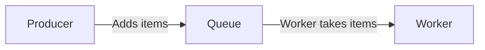
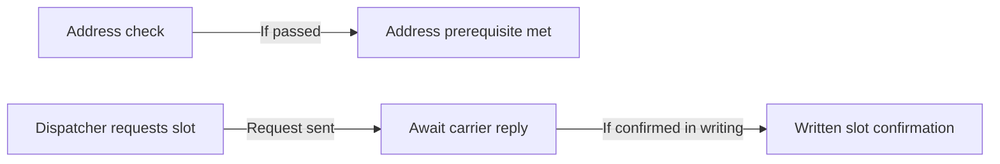

# Modes and worked examples

Read the mode needed for the current output. For ambiguous grammar or a meaning-sensitive edit, use [meaning and grammar](meaning-and-grammar.md); for lexical lookup and protected structures, use [lexicon and checks](lexicon-and-checks.md).

## Layout that serves the reader

Put precision before brevity. Let each small block answer one immediate reader question or support one action, usually in one or two short sentences.

Keep necessary qualifications with the claims they govern. Split independently useful lookups such as current state, approval authority and next action, even inside a bullet or table cell.

Use concise bullets for parallel actions, conditions or choices. Use a table for brief comparable facts; place multi-actor instructions or prose explanations in small blocks instead.

Use headings only for useful groups. A brief personal exchange usually needs ordinary connected prose rather than a fixed framework.

Never author an em dash (U+2014) in prose, headings, list items, table cells or diagram labels. Recast with periods, commas, colons or parentheses; do not imitate it with double hyphens or spaced hyphens.

Required literal quotations, code and exact tokens remain unchanged. There is no universal word cap, paragraph quota or required number of sections.

### Small inline diagrams

Proactively use a small inline Mermaid diagram when a process, architecture, data flow, decision or handover is easier to grasp visually. Put it beside the explanation and keep its scope small.

An arrow must express a supported relationship. Preserve optionality, concurrent work and authority; do not make a request look like a completed event or a prerequisite look like guaranteed success.

Keep the current case separate from the general workflow. "Address check pending" describes a case, while "Dispatch after approval" describes a rule.

For parallel prerequisites, join their paths at an explicit gate. Do not draw one prerequisite after the other unless the source establishes that order.

## Conversation, email and everyday writing

Answer the actual social or informational need. "Thanks for checking!" can receive "You're welcome!" without an editorial explanation.

Keep contractions, warmth, idiom and stated pronouns when they fit the exchange. Do not make ordinary requests artificially formal or append canned praise and generic endings.

For an email or team update, make the purpose visible in the subject or opening. Include a necessary evidence limit there rather than relying on a later paragraph to correct it.

Select information relevant to the recipient. A person asked to confirm a delivery slot does not necessarily need the whole internal budget or approval plan.

Make a clear, proportionate request when the reader's decision or missing information can advance the exchange. Keep a request distinct from an accepted offer, confirmed arrangement or commitment.

**Example: inaccessible attachment**

Known facts: the attachment cannot be opened, and the reader is asked to resend it.

> I can't open the attachment. Could you resend it?

Do not invent a reason such as a damaged file or security block. The request need not become a technical diagnosis.

**Example: conditional personal reply**

Known facts: the writer will bring bread if it rises by Saturday at 21:00. If it does not, they will bring apples.

> I'll bring the bread if it rises by Saturday at 21:00. If it doesn't, I'll bring apples.

The alternative stays conditional. A simpler but unconditional "I'll bring bread" would change the commitment.

## Technical explanation

Name the mechanism accurately, then explain unfamiliar terms where they matter. Use a small example with explicit assumptions when it reduces the reader's effort.

Do not describe a code path as wanting, believing or negotiating. Explain known actors, operations and results rather than technical-sounding metaphors.

**Example: an idempotency key**

Provided behavior: repeated requests with the same key create at most one order.

> The key lets the service recognize repeated requests. In this system, requests with the same key create no more than one order.

Zero orders remain possible. "Exactly one order is always created" would introduce an unsupported success guarantee.

**Example: a simple data flow**

Suppose a producer adds items to a queue and a worker takes items from that queue.

The diagram says nothing about ordering, delivery guarantees, retries or acknowledgements. Add those relationships only when the system's behavior is known and relevant.

An analogy may help introduce an unfamiliar idea. Follow it with the real mechanism so that the analogy does not become an implementation claim.

## Procedures and handovers

A useful procedure identifies known prerequisites, who acts, where to act, the required order and what confirms the result. Separate actions from expected or observed states.

Number steps when order matters. Mark optional actions explicitly and keep concurrent actions concurrent; include recovery only when its behavior is established.

**Example: a conditional export**

Known facts: the user opens Settings, chooses Export and downloads only if Ready appears.

1. Open Settings.
2. Choose Export.
3. If Ready appears, select Download.

Do not invent a time-to-ready promise, retry button or automatic download. If the task includes designing the procedure and recovery is unknown, record that gap outside the proposed product copy.

### A handover with several actors

Surface established constraints, unresolved gaps and supported duties, owners and deadlines. Missing ownership stays unresolved rather than becoming an invented assignment.

Keep facts, checked consequences and proposed arrangements distinguishable. A stated requirement and a proposal to satisfy it are different information.

**Example facts**

- The coordinator may dispatch only after the address check passes.
- Packing is optional and may happen before the address check.
- The dispatcher requests a slot; the carrier confirms it in writing.

**Handover copy**

- **Address check:** The coordinator may dispatch only after it passes.
- **Packing:** Optional. It may happen before the address check.
- **Slot confirmation:** The dispatcher requests the slot. Written confirmation comes from the carrier.

Each block supports a different lookup. The carrier's confirmation must not be silently replaced with the dispatcher's request.

Meeting the address prerequisite does not command dispatch or settle other permissions. These paths do not imply that slot confirmation is a dispatch prerequisite; add that dependency only if the source states it.

Show optional packing separately instead of turning it into a mandatory step.

### Warnings and recovery

Place an established warning before the affected action. Preserve the domain's actual warning terms and the known consequence.

If a command permanently deletes the selected backup, say so. Do not invent permanence, recovery, cascades or unrelated hazards from a label such as "Delete."

Editing can clarify a validated procedure, but it cannot validate the procedure's safety. Avoid unsolicited warnings about hypothetical risks unrelated to the task.

## Interface text

Use an action label for what a control does and a state label for what has occurred. A short label must preserve the real scope even when seen without the surrounding explanation.

| Confirmed state | Accurate label | Unsupported strengthening |
| --- | --- | --- |
| Waiting for processing | Queued | Sent |
| Dispatched by the system | Sent | Delivered |
| Saved only on this device | Saved locally | Synchronized |
| No verification result | Not verified | Being checked |
| Count not established | Count unknown | 0 |

Keep "delivered" tied to the defined endpoint. Delivery to a receiving mail server does not establish that a person read or accepted the message.

If a requested control has no defined action, state the missing requirement outside proposed copy. Do not invent a plausible button behavior, recovery route or reassurance.

For a designer handoff, separate proposed strings from implementation notes. In a strings-only request, return the strings rather than adding advice about controls, state machines or retry policies.

### Validation errors and service failures

Identify the affected input and a supported correction when one is known. For an inclusive 10 MB limit, use "Choose a file that is 10 MB or smaller."

"Choose a file smaller than 10 MB" excludes a permitted boundary. A smooth error message that changes the limit is incorrect.

Distinguish an invalid input from a service failure. If the cause is unknown, do not blame the user's file or invent a route such as "Try again in five minutes."

Preserve established privacy and security limits in the correction. Helpful copy does not justify revealing information the product's behavior is designed to withhold.

### Retry boundaries and timeout states

Keep a timeout separate from rejection, deletion or failure when the source distinguishes them. "No response received" does not establish that the server rejected the request.

If the actual rule permits retry only after a timeout and while the attempt count is strictly below the maximum, keep both conditions. A maximum that includes the first attempt is a total-attempt limit, not a retry count.

When the last timeout requires staff to review the existing request, do not replace that with creating a new request. Explain only the known action and preserve any existing identifier or placeholder.

### Labels and accessibility

Provide enough input guidance to identify what is required. Keep visible wording represented in the proposed accessible name where it applies, such as "Download report" rather than an unrelated "Get file."

Visible guidance, accessible names, focus behavior and status announcements are related but distinct. A copy review does not establish their runtime implementation or full accessibility compliance.

Include implementation notes only when the task requests a design or accessibility review. Keep them outside the copy users will see.

### Structured and localized messages

Preserve message keys, placeholders and plural syntax unless those parts are explicitly editable. A placeholder that survives globally may still have moved to the wrong message.

Review full formatted messages with zero, one, several and large counts, long names and missing values. Use the actual formatter and target language's plural rules rather than translating fragments independently.

"Saved {count} files" can illustrate a simpler value, but it does not resolve the singular case by itself. The message's real plural structure determines the required variants.

## Translation and localization

Translate the meaning into the requested language. Keep actor relationships, tense, force, negation, conditions, register and references while using natural target-language grammar.

An English source or quotation does not override a request for another output language. Preserve technical identifiers and exact quoted strings when their contract requires it.

Translation and conversion are separate choices. Do not silently change currency, measurement units, date interpretation or number precision because the prose changes language.

Use consistent terminology for the same concept. Do not replace a precise domain term with a broader everyday word just to avoid repetition.

Read the whole formatted message, including surrounding labels and representative values. A technically preserved placeholder does not guarantee grammatical agreement after interpolation.

**Example**

Source: `ანგარიში ჯერ არ არის მზად.`

English: "The report is not ready yet."

The negative state and "yet" remain. "The report will be ready soon" would invent a prediction.

## Creative work

Preserve intentional metaphor, rhythm, ambiguity, dialogue and fragments when they serve the requested voice. Improve accidental obstructions without making every line literal.

Keep the author's chosen register, pronouns and English variety. A technical controlled vocabulary or prose sentence template does not belong in a poem by default.

The prohibition on authored em dashes still applies. Recast punctuation in a way that respects rhythm; preserve a protected exact quotation rather than silently changing it.

**Source**

> The moon kept my secret / while the city forgot my name.

**Light edit**

> The moon kept my secret
> while the city forgot my name.

The metaphor and two-line structure remain. Turning the line into a literal report would fail the creative task.

## Full worked edits

The examples below use invented facts to show editing decisions. Their explanations are for choosing the revision, not for appending to every drafted response.

### An evidence-sensitive update

**Source:** "The vendor says that the issue has now been fixed. The fix hasn't been tested by us yet."

**Revision:** "The vendor says the issue is fixed. We have not tested the fix yet."

The vendor remains the source and the local check remains absent. "Yet" keeps the temporal meaning; "The issue is fixed" alone would overstate the available evidence.

If the same facts are needed in other formats:

- **Email subject:** "Vendor reports a fix; we have not tested it yet."
- **Team update:** "The vendor says the issue is fixed. We have not tested the fix yet."
- **Compact status:** "Vendor reports a fix. Not tested by us yet."

Do not add "We're checking it now" unless the check has started. All versions keep attribution and the missing check visible.

### A conditional permission

**Source:** "If the reviewer has approved the draft, you are permitted to publish it, but publication is not required."

**Revision:** "If the reviewer has approved the draft, you may publish it. You are not required to publish it."

Permission remains conditional and does not become a command. Retaining the explicit non-requirement makes the source's choice easy to see.

### An exact-format edit

**Source:** `{"error":"An error has occurred while saving {file_name}."}`

**Revision:** `{"error":"Could not save {file_name}."}`

The key and placeholder stay exact. The message does not claim that earlier contents were preserved or that retrying will work.

### A compact budget explanation

Known facts: the budget is 760; commitments total 510; of that total, 170 is paid. A new quote is 275.

| Item | Amount |
| --- | --- |
| Budget | 760 |
| Commitments | 510 |
| Paid part of commitments | 170 |
| Unpaid part of commitments | 340 |
| Remaining after commitments | 250 |
| New quote | 275 |

The quote exceeds the remaining budget by 25. The source does not establish approval for that extra amount or an accepted quote.

Keep a decision or request for approval in its own short block. Do not compress the whole handover into the table or subtract only paid amounts from the budget.
